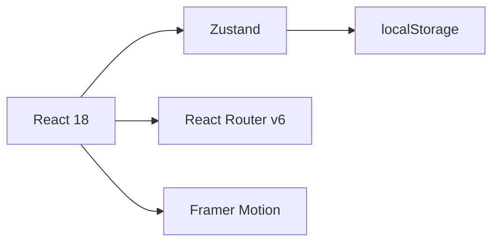

<div align="center">
  
# 🎬 Almanack - Movie Booking Platform


A modern, responsive movie booking application built with React + Zustand + Tailwind CSS + DaisyUI

[](https://reactjs.org/)
[](https://tailwindcss.com/)
[](https://daisyui.com/)
[](https://github.com/pmndrs/zustand)
[](https://www.framer.com/motion/)

</div>

## 🌟 Features Showcase


### 🔐 Authentication System
- Secure login system with username/password validation
- Protected routes using React Router v6
- Session persistence using localStorage
- Toast notifications using React Hot Toast

### 🎥 Movie Dashboard
- Responsive grid layout with Tailwind CSS
- Real-time search with debounce
- Framer Motion animations
- DaisyUI components for consistent UI

### 🎟️ Ticket Selection
- Interactive UI components from DaisyUI
- Datetime handling with native inputs
- Real-time price calculations
- Success notifications with React Hot Toast

### 📊 Activity Tracking
- Comprehensive booking history
- Clean tabular layout using Tailwind CSS
- Persistent storage with Zustand + localStorage

## 🛠️ Technical Stack

### Core Technologies


### Styling & UI
- 🎨 **Tailwind CSS** - Utility-first CSS framework
- 💅 **DaisyUI** - Component library for Tailwind CSS
- 🖼️ **Lucide React** - Modern icon library
- ✨ **Framer Motion** - Animation library

### State Management & Data Flow
- 📦 **Zustand** - Lightweight state management
- 💾 **localStorage** - Persistent storage
- 🔄 **Custom Hooks** - Reusable logic

### Development Tools
- 🔧 **Vite** - Next Generation Frontend Tooling
- 📝 **ESLint** - Code quality tool
- 🎯 **Prettier** - Code formatter

## 🚀 Quick Start

```bash
# Clone the repository
git clone https://github.com/yourusername/almanack.git](https://github.com/ArnavAnand10/Frontend-Task.git

# Install dependencies
cd client
npm install

# Start development server
npm run dev
```

## 🔑 Demo Access

```json
{
  "username": "naval.ravikant",
  "password": "05111974"
}
```

## 📂 Project Architecture

```
src/
├── 📱 components/
│   ├── ActivityScreen.js    # Booking history view
│   ├── LoginForm.js        # Authentication component
│   ├── MovieDashboard.js   # Movie listing view
│   ├── Navbar.js           # Navigation component
│   └── SelectionScreen.js  # Ticket booking view
├── 📦 store/
│   └── movieStore.js       # Zustand store configuration
├── 🎭 constants/
│   └── movies.js           # Movie data
└── 🎯 App.js               # Main application component
```

## ⚙️ State Management with Zustand

```javascript
import create from 'zustand'
import { persist } from 'zustand/middleware'

const useStore = create(persist(
  (set) => ({
    movies: [],
    bookings: [],
    addBooking: (booking) => set((state) => ({ 
      bookings: [...state.bookings, booking] 
    })),
  }),
  {
    name: 'movie-storage',
  }
))
```

## 🎨 UI Components with DaisyUI

```jsx
<div className="card w-96 bg-base-100 shadow-xl">
  <figure>
    
  </figure>
  <div className="card-body">
    <h2 className="card-title">Movie Title</h2>
    <div className="card-actions justify-end">
      <button className="btn btn-primary">Book Now</button>
    </div>
  </div>
</div>
```

## 🌈 Animation with Framer Motion

```jsx
<motion.div
  initial={{ opacity: 0, y: 20 }}
  animate={{ opacity: 1, y: 0 }}
  exit={{ opacity: 0 }}
  transition={{ duration: 0.5 }}
>
  {/* Component content */}
</motion.div>
```

## 📱 Responsive Design

- 💻 Desktop - Full experience
- 📱 Tablet - Optimized layout
- 📱 Mobile - Touch-friendly interface

## 🤝 Contributing

Contributions are welcome! Please feel free to submit a Pull Request.

## 📄 License

This project is licensed under the MIT License - see the [LICENSE.md](LICENSE.md) file for details.

---

<div align="center">

Made with ❤️ using React + Zustand + Tailwind + DaisyUI

[Live Demo](https://your-demo-link.com) | [Documentation](https://your-docs-link.com) | [Report Bug](https://github.com/yourusername/almanack/issues)

</div>
